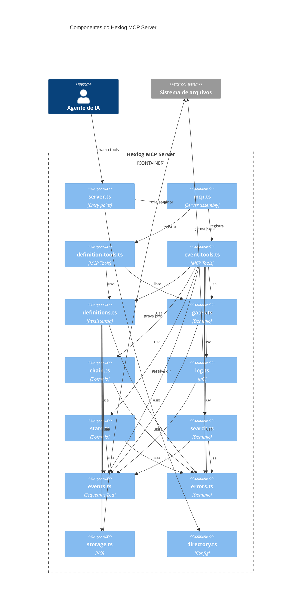

<!-- Parent: ./AGENTS.md -->

# Diagrama C3 (Componentes) — hexlog

Diagrama de componentes (nível C3 do C4 Model) do container principal do
projeto: o servidor MCP stdio (`src/`). Gerado a partir do grafo de
dependências internas descrito em `src/AGENTS.md`.

> Sintaxe validada via MCP mermaid (`validate_and_render_mermaid_diagram`).
> A versão com descrição longa por componente estourava o limite de
> tamanho do PNG de validação; por isso as descrições ficam na tabela
> abaixo, e o diagrama usa só alias/nome/tipo.

| Componente | O que faz |
|---|---|
| `server.ts` | Entry point — `serveStdio(() => createServer(...))` |
| `mcp.ts` | Monta `McpServer`; envelope `execute()` (erro + log) |
| `definition-tools.ts` | 5 tools: `list`, `register_type`, `register_vocabulary`, `register_gate`, `create_process` |
| `event-tools.ts` | 5 tools: `register`, `evaluate_gate`, `state`, `events`, `chain` |
| `definitions.ts` | Persistência: `registerType`, `createProcess`, `loadProcess`, `listProjects` |
| `gates.ts` | 4 gates embutidos: `no-orphans`, `no-conflicts`, `chain-intact`, `no-invalid-references` |
| `chain.ts` | `sha256hex`, `hashLine`, `anchor`, `isValidLink`, `verifyChain` |
| `log.ts` | Append/readText sob lock por diretório |
| `state.ts` | `projectState`, `validateField` |
| `search.ts` | Índice MiniSearch sob demanda |
| `events.ts` | Esquemas Zod: `EventLine`, `MilestoneData`, `VerdictData`, `GateMilestoneData` |
| `errors.ts` | `HexlogError`, `ErrorCode` (23 códigos), `issueDetails` |
| `storage.ts` | `resolveSafePath`, `writeJsonAtomic`, `readJson` |
| `directory.ts` | `dataDir(env)` — resolve `$XDG_DATA_HOME/hexlog` (fallback `~/.local/share/hexlog`) |

## Fora deste diagrama

Dois subgrafos ficam fora do container do servidor porque não fazem parte
do processo MCP em runtime — entram no C2 (containers) do projeto, não
neste C3:

- **`guard.ts` + `installation.ts`** (em `src/`): puros, usados só por
  `scripts/install.ts`. Não são importados por `server.ts` nem pelo hook.
- **`hook/bash-guard.ts`**: processo `PreToolUse` separado, registrado no
  `settings.json` do Claude Code; consome só `directory.ts` do servidor.

## Fonte

Componentes e relações extraídos de `src/AGENTS.md` (seção "Dependencies →
Internal", gerada em 2026-09-17). Atualize este diagrama junto de
`src/AGENTS.md` sempre que um módulo mudar de dependências.
