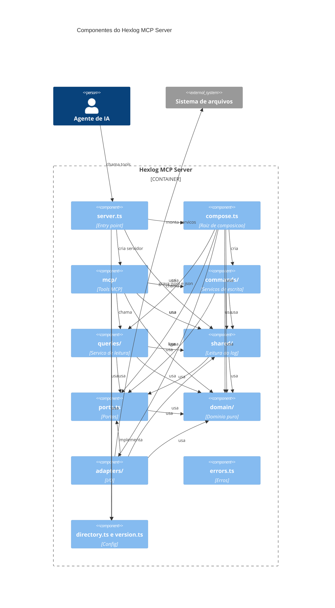

<!-- Parent: ./AGENTS.md -->

# Diagrama C3 (Componentes) — hexlog

Diagrama de componentes (nível C3 do C4 Model) do container principal do
projeto: o servidor MCP stdio (`src/`), nas camadas da 1.0. Gerado a partir do
grafo de dependências internas descrito em `src/AGENTS.md`; o diagrama mostra
uma camada por componente e a tabela abaixo abre os módulos de cada uma.

> Sintaxe validada via MCP mermaid (`validate_and_render_mermaid_diagram`).
> As descrições ficam na tabela abaixo, e o diagrama usa só alias/nome/tipo,
> porque descrição longa por componente estoura o limite de tamanho do PNG de
> validação.

```mermaid
C4Component
    title Componentes do Hexlog MCP Server

    Person(agent, "Agente de IA")
    System_Ext(fs, "Sistema de arquivos")

    Container_Boundary(server, "Hexlog MCP Server") {
        Component(serverTs, "server.ts", "Entry point")
        Component(compose, "compose.ts", "Raiz de composicao")
        Component(mcp, "mcp/", "Tools MCP")
        Component(commands, "commands/", "Servicos de escrita")
        Component(queries, "queries/", "Servico de leitura")
        Component(shared, "shared/", "Leitura do log")
        Component(ports, "ports.ts", "Portas")
        Component(domain, "domain/", "Dominio puro")
        Component(adapters, "adapters/", "I/O")
        Component(errors, "errors.ts", "Erros")
        Component(config, "directory.ts e version.ts", "Config")
    }

    Rel(agent, serverTs, "chama tools")
    Rel(serverTs, config, "usa")
    Rel(serverTs, compose, "monta servicos")
    Rel(serverTs, mcp, "cria servidor")
    Rel(mcp, commands, "chama")
    Rel(mcp, queries, "chama")
    Rel(mcp, domain, "usa")
    Rel(mcp, shared, "usa")
    Rel(mcp, config, "usa")
    Rel(compose, adapters, "liga")
    Rel(compose, commands, "cria")
    Rel(compose, queries, "cria")
    Rel(compose, shared, "usa")
    Rel(compose, ports, "usa")
    Rel(compose, domain, "usa")
    Rel(adapters, shared, "usa")
    Rel(serverTs, shared, "usa")
    Rel(commands, ports, "usa")
    Rel(commands, shared, "usa")
    Rel(commands, domain, "usa")
    Rel(queries, ports, "usa")
    Rel(queries, shared, "usa")
    Rel(queries, domain, "usa")
    Rel(shared, ports, "usa")
    Rel(shared, domain, "usa")
    Rel(adapters, ports, "implementa")
    Rel(adapters, domain, "usa")
    Rel(ports, domain, "usa")
    Rel(adapters, fs, "grava jsonl e json")
```

Toda camada importa `errors.ts`; as arestas ficam fora do desenho para não
estourar o limite de PNG. `domain/` não importa camada nenhuma acima, só
`errors.ts` (`domain/definitions.ts` e `domain/chain.ts` usam `HexlogError`), e
`errors.ts` importa de volta só os tipos `Name` e `RecordId`, sem ciclo em runtime.

| Componente | O que faz |
|---|---|
| `server.ts` | Entry point: `compose`, log `start` (`dataDir` e `version`), `createServer` e `serveStdio` |
| `compose.ts` | `compose`: a raiz de composição; único módulo do servidor em runtime, fora de `adapters/`, que conhece os adaptadores de disco; liga validador, stores e `createSearchIndex` aos quatro serviços |
| `mcp/kernel.ts`, `mcp/server.ts` | `execute()` (envelope de erro e log de toda tool) e `createServer` (`McpServer` com as 12 tools) |
| `mcp/tools/` | `process.ts`, `definition.ts`, `attachment.ts` e `query.ts`: uma `register*Tools` por família |
| `commands/` | `createProcessService` (`createProcess`, `register`), `createDefinitionService` (`defineType`, `defineRelation`, `defineGate`) e `createAttachmentService` (`attach`); as etapas do `register` ficam em `commands/register/` |
| `queries/` | `createQueryService` (`queryRecords`, `evaluateGate`, `verifyChain`, `list`, `readAttachment`, `describeType`), com `list`, `readAttachment` e `describeType` em `list.ts`, `read-attachment.ts` e `describe-type.ts`, mais `select.ts`, `read.ts` e `cursor.ts#encodeCursor` |
| `shared/` | `loader.ts` (`parseLog`, `verifyProcess`, `loadVerified`), `logger.ts` (`Logger`) e `pages.ts` (`sliceChars`) |
| `ports.ts` | As portas do núcleo: `ProcessStore`, `DefinitionStore`, `AttachmentStore`, `Validator` e `SearchIndex` |
| `domain/` | Núcleo puro: `ids.ts`, `record.ts`, `chain.ts` (`hashLink`, `anchor`, `isValidLink`), `relations.ts` (`checkRelation`), `definitions.ts`, `gate.ts` (`evaluateGate`) e `manifest.ts` |
| `adapters/fs/` | Stores de processo, definição e anexo, lock, gravação atômica, formato em disco (`<D>/.v1`) e helpers de I/O; um módulo por linha em [`src/AGENTS.md`](../src/AGENTS.md) |
| `adapters/validator.ts`, `adapters/search.ts` | `createValidator` (ajv, `ajv-formats` e o catálogo de formatos de `domain/formats.ts`) e `createSearchIndex` (MiniSearch cacheado por processo) |
| `errors.ts` | `HexlogError`, `ErrorCode`, `issueDetails` |
| `directory.ts` | `dataDir(env)`: resolve `$XDG_DATA_HOME/hexlog` (fallback `~/.local/share/hexlog`) |
| `version.ts` | `VERSION`: versão do servidor, reportada no handshake MCP e no log `start` |

A direção das dependências é travada por `eslint.boundaries.js`
(`boundaryBlocks`), verificada por `test/boundaries.spec.ts`.

## Fora deste diagrama

Três módulos ficam fora do container do servidor porque não fazem parte do
processo MCP em runtime; entram no C2 (containers) do projeto, não neste C3:

- **`guard.ts`, `installation.ts` e `archive.ts`** (em `src/`): usados só por
  `scripts/install.ts`. Não são importados por `server.ts` nem pelo hook.
  `archive.ts` (`inspectLegacy`, `archiveLegacy`) arquiva o dado 0.x. `installation.ts`,
  `archive.ts` e `scripts/install.ts` também importam `adapters/fs/`, o que não fere a
  regra de `compose.ts`: nenhum deles roda dentro do servidor.
- **`hook/bash-guard.ts`**: processo `PreToolUse` separado, registrado no
  `settings.json` do Claude Code; consome só `directory.ts` do servidor.

## Fonte

Componentes e relações conferidos contra os imports internos de `src/` em
2026-10-03 (layout 1.0). Atualize este diagrama junto de `src/AGENTS.md` sempre
que uma camada mudar de dependências.
