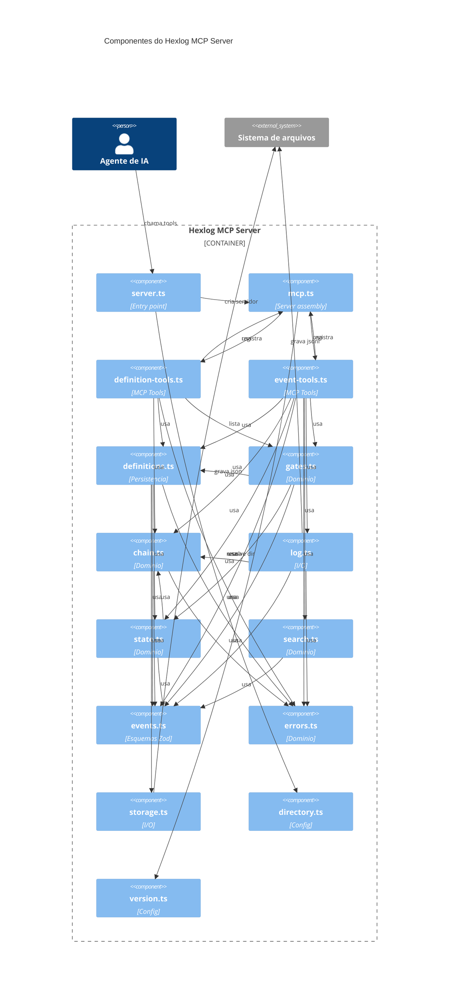

<!-- Parent: ./AGENTS.md -->

# Diagrama C3 (Componentes) — hexlog

Diagrama de componentes (nível C3 do C4 Model) do container principal do
projeto: o servidor MCP stdio (`src/`). Gerado a partir do grafo de
dependências internas descrito em `src/AGENTS.md`.

> Sintaxe validada via MCP mermaid (`validate_and_render_mermaid_diagram`).
> A versão com descrição longa por componente estourava o limite de
> tamanho do PNG de validação; por isso as descrições ficam na tabela
> abaixo, e o diagrama usa só alias/nome/tipo. Após a revisão de
> 2026-09-26, o número de arestas por si só voltou a estourar o mesmo
> limite de PNG; a sintaxe foi conferida manualmente e por render de uma
> cópia sem labels/tipo (estrutura idêntica de nós e arestas), que passou.

```mermaid
C4Component
    title Componentes do Hexlog MCP Server

    Person(agent, "Agente de IA")
    System_Ext(fs, "Sistema de arquivos")

    Container_Boundary(server, "Hexlog MCP Server") {
        Component(serverTs, "server.ts", "Entry point")
        Component(mcpTs, "mcp.ts", "Server assembly")
        Component(defTools, "definition-tools.ts", "MCP Tools")
        Component(evtTools, "event-tools.ts", "MCP Tools")
        Component(definitions, "definitions.ts", "Persistencia")
        Component(gates, "gates.ts", "Dominio")
        Component(chain, "chain.ts", "Dominio")
        Component(log, "log.ts", "I/O")
        Component(state, "state.ts", "Dominio")
        Component(search, "search.ts", "Dominio")
        Component(events, "events.ts", "Esquemas Zod")
        Component(errors, "errors.ts", "Dominio")
        Component(storage, "storage.ts", "I/O")
        Component(directory, "directory.ts", "Config")
        Component(version, "version.ts", "Config")
    }

    Rel(agent, serverTs, "chama tools")
    Rel(serverTs, directory, "resolve dir")
    Rel(serverTs, mcpTs, "cria servidor")
    Rel(mcpTs, defTools, "registra")
    Rel(mcpTs, evtTools, "registra")
    Rel(mcpTs, version, "usa")
    Rel(defTools, definitions, "usa")
    Rel(defTools, gates, "lista")
    Rel(defTools, chain, "usa")
    Rel(defTools, errors, "usa")
    Rel(defTools, mcpTs, "usa")
    Rel(evtTools, definitions, "usa")
    Rel(evtTools, log, "usa")
    Rel(evtTools, chain, "usa")
    Rel(evtTools, state, "usa")
    Rel(evtTools, gates, "usa")
    Rel(evtTools, search, "usa")
    Rel(evtTools, events, "usa")
    Rel(evtTools, errors, "usa")
    Rel(evtTools, mcpTs, "usa")
    Rel(definitions, storage, "usa")
    Rel(definitions, events, "usa")
    Rel(definitions, errors, "usa")
    Rel(definitions, state, "usa")
    Rel(chain, events, "usa")
    Rel(chain, errors, "usa")
    Rel(log, events, "usa")
    Rel(log, errors, "usa")
    Rel(log, chain, "usa")
    Rel(state, events, "usa")
    Rel(state, chain, "usa")
    Rel(gates, events, "usa")
    Rel(gates, definitions, "usa")
    Rel(gates, state, "usa")
    Rel(search, events, "usa")
    Rel(log, fs, "grava jsonl")
    Rel(storage, fs, "grava json")
```

| Componente | O que faz |
|---|---|
| `server.ts` | Entry point — `serveStdio(() => createServer(...))` |
| `mcp.ts` | Monta `McpServer`; envelope `execute()` (erro + log) |
| `definition-tools.ts` | 5 tools: `list`, `register_type`, `register_vocabulary`, `register_gate`, `create_process` |
| `event-tools.ts` | 5 tools: `register`, `evaluate_gate`, `state`, `events`, `chain` |
| `definitions.ts` | Persistência: `registerType`, `createProcess`, `loadProcess`, `listProjects` |
| `gates.ts` | 5 gates embutidos: `no-orphans`, `no-conflicts`, `no-forks`, `chain-intact`, `no-invalid-references` |
| `chain.ts` | `sha256hex`, `hashLine`, `anchor`, `isValidLink`, `verifyChain` |
| `log.ts` | Append/readText sob lock por diretório |
| `state.ts` | `projectState`, `validateField` |
| `search.ts` | Índice MiniSearch sob demanda |
| `events.ts` | Esquemas Zod: `EventLine`, `MilestoneData`, `VerdictData`, `GateMilestoneData` |
| `errors.ts` | `HexlogError`, `ErrorCode` (35 códigos), `issueDetails` |
| `storage.ts` | `resolveSafePath`, `writeJsonAtomic`, `readJson` |
| `directory.ts` | `dataDir(env)` — resolve `$XDG_DATA_HOME/hexlog` (fallback `~/.local/share/hexlog`) |
| `version.ts` | `VERSION` — versão do servidor, reportada no handshake MCP e no log `start` |

## Fora deste diagrama

Dois subgrafos ficam fora do container do servidor porque não fazem parte
do processo MCP em runtime — entram no C2 (containers) do projeto, não
neste C3:

- **`guard.ts` + `installation.ts`** (em `src/`): puros, usados só por
  `scripts/install.ts`. Não são importados por `server.ts` nem pelo hook.
- **`hook/bash-guard.ts`**: processo `PreToolUse` separado, registrado no
  `settings.json` do Claude Code; consome só `directory.ts` do servidor.

## Fonte

Componentes e relações conferidos contra os imports internos de `src/*.ts`
em 2026-09-28 (revisão pós PR #31, #32 e #35). Atualize este diagrama junto de
`src/AGENTS.md` sempre que um módulo mudar de dependências.
